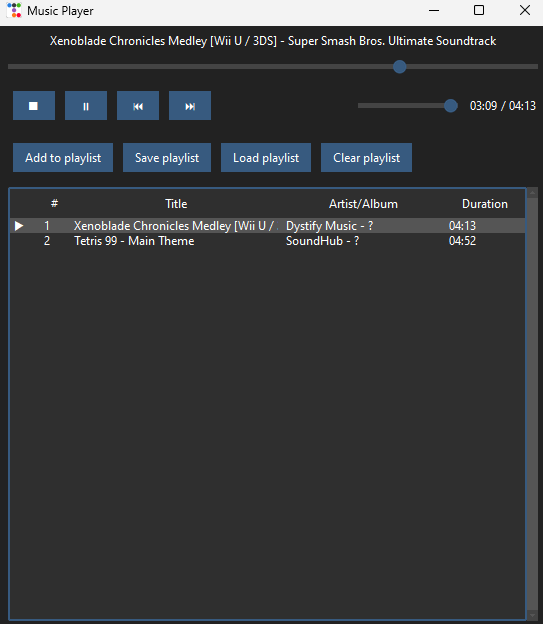

# pyGUIPlayer

## Description

pyGUIPlayer is a Python-based music player built with a graphical user interface using `ttkbootstrap` for enhanced styling. The player offers functionality for loading, playing, and managing playlists with intuitive playback controls, volume adjustments, and an expandable playlist view.

**This is my learning project to explore Python.**

## Preview



## Features

- **Playback Controls**:
  - Play, pause, stop, next, and previous track buttons for easy music control.
  - Song progress slider to seek within a track.
  - Volume slider for adjusting audio levels.

- **Playlist Management**:
  - Load, save, and clear playlists with ease.
  - Add new tracks to the playlist.
  - Double-click a track to play it, with vertical scrolling support for large playlists.
  - Delete selected tracks from the playlist.

- **User Interface**:
  - Responsive and modern UI using `ttkbootstrap`.
  - Real-time updating of track name, playback status, and timing labels.
  - Grid layout and intuitive button placement for user-friendly operation.

## Installation

To use pyGUIPlayer, you need to have Python installed. Follow these steps to set up the project:

1. Clone the repository:
   ```bash
   git clone https://github.com/Elrcx/pyGUIPlayer.git
   cd pyGUIPlayer
   ```

2. Install the required dependencies:
   ```bash
   pip install -r requirements.txt
   ```

3. Run the application:
   ```bash
   python __main__.py
   ```

## Usage

- **Playback**: Use the playback controls (play, pause, next, etc.) to manage the audio track.
- **Playlist**:
  - Add new tracks to the playlist by clicking "Add to playlist".
  - Save and load playlists to retain track lists.
  - Use the track list to view track details and select tracks for playback.
- **Volume Control**: Adjust the volume using the slider provided.
- **Navigation**: Double-click a track to change songs quickly or use the arrow buttons for navigation.

## License

This project is licensed under the [Beerware](https://en.wikipedia.org/wiki/Beerware).

